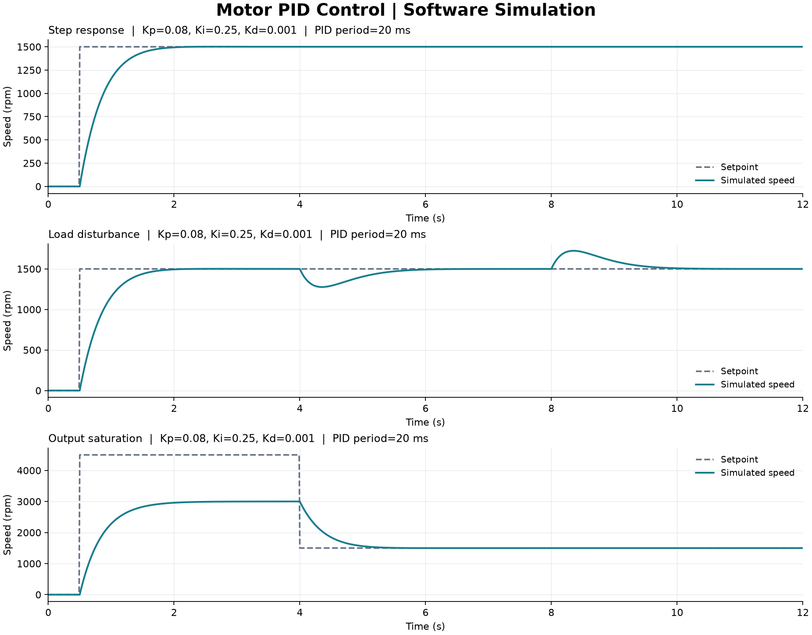

# 电机 PID 控制仿真实验

一个不用接线就能运行的嵌入式控制学习项目：使用 **C++、Arduino PID Library 和 Python**，观察电机调速、负载扰动及输出饱和后的响应。

**当前为电脑端软件仿真，尚未进行开发板或实物电机验证。** 仿真中的转速与 PWM 数值是模型计算结果。

本项目基于 [Brett Beauregard 的 Arduino-PID-Library](https://github.com/br3ttb/Arduino-PID-Library)。原始 PID 源码保持不变；新增部分是模拟电机、实验场景、自动测试、数据记录和报告。来源及许可证见 [UPSTREAM.md](UPSTREAM.md)。

## 演示

运行后生成三组转速与控制输出曲线：



| 实验 | 要观察的问题 |
| --- | --- |
| 目标转速阶跃 `step` | 给定值变化后，电机多久接近目标转速 |
| 负载扰动 `load` | 施加和移除模拟负载时，闭环如何恢复转速 |
| 输出饱和 `saturation` | 目标高于模型最大转速时，输出如何限幅，目标恢复后会怎样 |

## 运行

需要 Python 3.10 或更高版本、支持 C++17 的 `g++`，以及用于绘图的 matplotlib。

```sh
python -m pip install -r requirements-demo.txt
python lab/run_demo.py
```

脚本编译 C++ 程序、执行测试、运行三组实验，然后生成 `results/` 下的 CSV、图表及 HTML 报告。用浏览器打开 `results/report.html`。

Windows 如果找不到编译器，可指定路径：

```powershell
python lab/run_demo.py --compiler "C:/msys64/ucrt64/bin/g++.exe"
```

这里只是编译器路径的例子，可替换为你自己的安装位置。程序不会自动安装工具，也不需要连接开发板。

测试默认在本地执行。`docs/github-actions-simulation.yml` 是可选的 GitHub Actions 配置示例，当前未启用云端工作流。

## 控制流程

```text
目标转速 → PID 控制器 → PWM 数值限幅 → 模拟电机 → 模拟转速反馈
                ↑                              │
                └──────────────────────────────┘
```

- 模拟电机采用一阶模型，最大空载转速 3000 rpm，时间常数 0.35 s。
- 仿真每 10 ms 推进一次，PID 每 20 ms 更新一次。
- 控制输出范围为 0–255，是理想的浮点 PWM 指令；尚未模拟真实 PWM 波形、量化误差或编码器噪声。
- 默认参数为 `Kp=0.08`、`Ki=0.25`、`Kd=0.001`，实验持续 12 s。这些参数针对本项目模型，不是实物电机的通用参数。
- 负载用等效转速损失表示；`load` 场景在 4–8 s 施加 600 rpm 的扰动。

## 文件结构

```text
PID_v1.cpp / PID_v1.h    上游 PID 实现，未修改
lab/host/               桌面端 Arduino 时间接口
lab/motor_sim.*         模拟电机和实验调度
lab/sim_main.cpp        命令行实验入口，输出 CSV
lab/test_pid.cpp        控制行为和采样周期测试
lab/run_demo.py         编译、测试、运行和报告入口
lab/make_report.py      曲线及 HTML 报告
docs/learning-log.md    可自行填写的实验记录
results/               本机生成的仿真数据，不提交到仓库
```

## 建议亲手做的三个练习

1. 跑通默认实验，解释目标转速、模拟转速和 PWM 三者的关系。
2. 改变比例或积分参数，比较曲线与误差指标，并把结果写入 [实验记录](docs/learning-log.md)。
3. 增加一个自己的场景，例如改变负载幅度或加入测量噪声，同时增加验证它的测试。

真实接板时，下一步是用定时器输出 PWM、用编码器测量转速，并处理电机驱动、采样时序和断线停机。这些属于后续工作。

## 放入作品集时如何描述

完成运行、理解并作出自己的改动后，按实际贡献记录所做的工作，例如“基于 Arduino PID 开源库，完成电机调速软件仿真，比较负载扰动与输出饱和场景的控制响应”。硬件验证完成后，再补充实际开发板、电机和实测数据。

本仓库的初版实验代码与文档由 Codex 辅助搭建。PID 算法实现来自上游作者，具体分工见 [UPSTREAM.md](UPSTREAM.md)。
